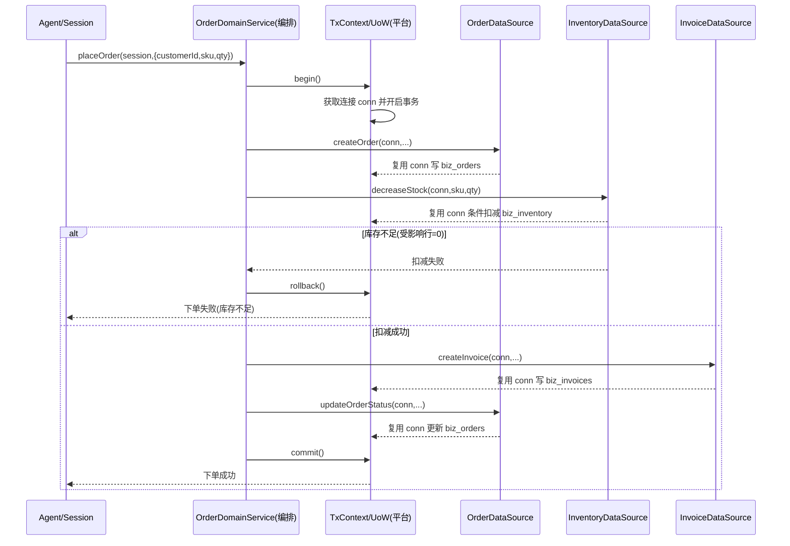

# DSH 跨表业务操作数据一致性 —— 架构设计评审与演进方案

> 架构师：高见远 · 2026-09-04
> 触发：6 个 biz Bundle 的表完全独立，真实场景一个业务动作会涉及多表原子改动。

## 0. 结论摘要

- **问题本质**：数据层是「6 个独立连接池 + 逻辑外键 + 各自提交」，业务层却是插件化松耦合。真实场景的「下单」这类复合操作没有事务边界，必然产生部分成功/脏数据。
- **演进分三层**：短期（同库：共享事务/UoW + 编排层收口）→ 中期（数据库级约束 + 租户隔离强化）→ 长期（拆库后转向 Outbox + SAGA 最终一致）。
- **最小侵入第一步**：接入 `@my-company/biz-shared`（resolveTenant 单源 + TenantTableBase），先消除「tenant 过滤逻辑 6 份内联」这一最大隐患；同步统一连接池为单例，为共享事务铺路。
- **事务边界 vs 插件边界**：跨表事务不必然破坏插件独立，关键是**把事务能力下沉为平台级基础设施（可注入的 TxContext/UoW），让 Bundle 只声明参与、不感知事务实现**。

## 1. 问题定性：当前结构在真实场景会踩哪些坑

| # | 现状 | 直接后果 |
|---|---|---|
| 1 | 6 个 DataSource 各自建池（3 个类内 `this.pool` + 3 个模块级 `poolPromise`） | 事务被锁死在单个连接上，跨 Bundle 无共享事务作用域 |
| 2 | 无物理外键，仅逻辑外键（存 id 字符串） | 无引用完整性，可产生悬空引用 / 孤儿行 |
| 3 | 无跨表事务，各 Bundle 各自 commit | 复合操作「部分成功」，产生脏数据 |
| 4 | `resolveTenant` / tenant 过滤逻辑 6 份内联 | 一处漏写即跨租户越权/污染，且难以审计 |
| 5 | `ensureSchema()` 各自独立建表 | 无统一 schema 版本管理，加约束/索引难同步 |
| 6 | 库存扣减等并发操作无唯一约束/原子扣减 | 丢失更新（lost update）→ 超卖 |

### 「下单」失败路径（具体）

下单 = ①校验 → ②建订单 → ③扣库存 → ④生成发票 → ⑤改订单状态。

- **P1（先建单后扣库存）**：② commit 后，③ 因并发库存不足失败 → 订单已落库但库存未扣（脏订单）。
- **P2（先扣库存后出发票）**：③ commit 后，④ 失败 → 库存已扣、订单停中间态、无发票。
- **P3（并发超卖）**：两个请求同时读库存=10，各自扣 1 → 无约束兜底，最终只减 1。
- **P4（悬空引用）**：customer_id 指向已删除 user。
- **P5（租户串数据）**：某 Bundle tenant 过滤漏写 → 跨租户串数据。

**结论**：根因不是「表独立」，而是「没有把跨表复合操作当做一个事务单元管理」。

## 2. 方案分层（演进路径）

### 2.1 短期（同库前提）：共享事务 + 编排层收口

前提成立：6 个连接串默认指向同一 SQL Server 实例同一库 `Database=DSH`，可享受单库 ACID。

候选方案对比：

| 方案 | 思路 | 对插件架构侵入 | 优点 | 风险 |
|---|---|---|---|---|
| A. 共享连接池 | 进程内单例 pool，DI 注入 | 低（改建连，不改 SQL） | 资源可控、为事务铺路 | 需统一连接串来源与生命周期 |
| B. 共享事务/UoW（TxContext） | 平台提供事务作用域，DataSource 复用事务连接 | 中（DataSource 需支持外部连接） | 最小改动获得跨表原子性 | 需定义连接/事务注入契约 |
| C. 领域服务收口 | 复合操作搬到某 Bundle 内直接操作多表 | 高（跨包依赖） | 逻辑集中 | 打破插件独立，无 pnpm 下不可行 |
| D. 独立编排层 | 新增装配单元协调各 Bundle | 高（新增协议） | 面向未来、最契合插件 | 短期重 |

**推荐：A + B 组合**，复合操作先落在「显式 TxScope 内的领域服务」上，业务动作增多后再演进到 D。

关键设计契约（只定接口，不定实现）：

- 平台在 `biz-shared` 提供 `TxContext / UnitOfWork`：`begin() / commit() / rollback()` + `getConnection()`。
- 各 DataSource 从「自己 new 连接」改为「优先从 TxContext 取连接」——单 Bundle 独立调用行为不变，复合操作共享同一条事务连接（MSSQL 事务必须绑在单条连接上）。
- 通过 **cordis** 把 TxContext 注册为进程内单例服务，各 Bundle 只依赖该接口、不依赖其它 Bundle 的类。

下单时序（with UoW）：

### 2.2 中期：数据库级约束 + 租户隔离强化

| 项 | 建议 | 说明 |
|---|---|---|
| 物理外键 | 有条件地加 | 明确 1:N 从属（invoice→order、order→user）可加，默认 RESTRICT；未来可能拆库的表暂缓，用应用层校验 + 唯一索引兜底 |
| CHECK 约束 | 加 | 状态枚举、金额/数量非负等，低成本高收益 |
| 唯一约束/索引 | 必须加 | 业务唯一键（order_no/invoice_no）+ 并发键（stock 的 `(sku, tenant)`），配合条件扣减防超卖 |
| 租户隔离 | 先应用层统一，再评估 RLS | TenantTableBase 强制 tenant 过滤 + tenant 作索引最左前缀；RLS 作纵深防御兜底 |
| 索引视图 | 不强求 | 复杂度高，中期非必需 |

### 2.3 长期：何时放弃单库强事务，转向最终一致/事件驱动

**判定信号（出现任一即应转向）**：

1. 不同 Bundle 数据落到不同数据库/服务实例（物理拆库）→ 单库 ACID 失效。
2. 单库成为吞吐瓶颈，需分库分表/读写分离。
3. 复合操作内出现「实时强一致」与「可稍后一致」混合的域。
4. 需要审计溯源/事件被多方消费。
5. 出现必须等待外部系统（支付回调、物流）的长事务。

**转向方案**：Outbox（本地事务内同时写业务表 + outbox 表，保证业务变更与事件发布原子）+ 事件驱动 SAGA（补偿、幂等键、去重消费、状态机）。

**原则**：同一物理库内强一致操作始终优先本地事务（最便宜最可靠）；拆库后才上分布式方案。

## 3. 最小侵入建议（无 pnpm、biz-shared 未接入）

按收益排序：

1. **【最先做·收益最大】接入 `@my-company/biz-shared`**：resolveTenant 单源化 + TenantTableBase 收口 tenant 过滤。这是 6 份重复逻辑里风险最高的一处，且是后续 tenant 唯一索引/RLS 的前提；以「源码 + 编译产物」交付，不依赖 pnpm 软链。
2. **统一连接池形态**：把「类内 `this.pool`」与「模块级 `poolPromise`」统一为「进程内按连接串缓存单例」，收敛连接串解析到一处。
3. **登记跨表复合操作清单 + 明确主控领域服务**：先以「顺序调用 + 每步幂等/可重试 + 对账兜底」保证可发现、可补偿。

> 真事务落地要等 1+2 完成后（有单例池 + 统一 TxContext 接口）才可行，1、2 是 3 的前置。

## 4. 事务边界 vs 插件边界

- **结论**：跨表事务不必然破坏插件独立；真正破坏的是「让 Bundle 之间直接互相 import」。
- **正交原理**：插件独立 = 装配/部署/生命周期独立；事务边界 = 数据一致性运行时作用域。
- **三条契约（避免强耦合）**：
  1. Bundle 只依赖平台接口（TxContext / TenantTableBase，均在 biz-shared），不依赖其它 Bundle 的类。
  2. 复合操作由编排层/领域服务通过平台统一执行器调度，而非 Bundle A 直接 import Bundle B。
  3. 跨 Bundle 交互走「领域能力接口」（decreaseStock / createInvoice），而非具体表/DataSource。
- **一句话**：把「事务」做成平台级基础设施（类似 cordis 服务），插件就仍是可插拔的独立单元。
